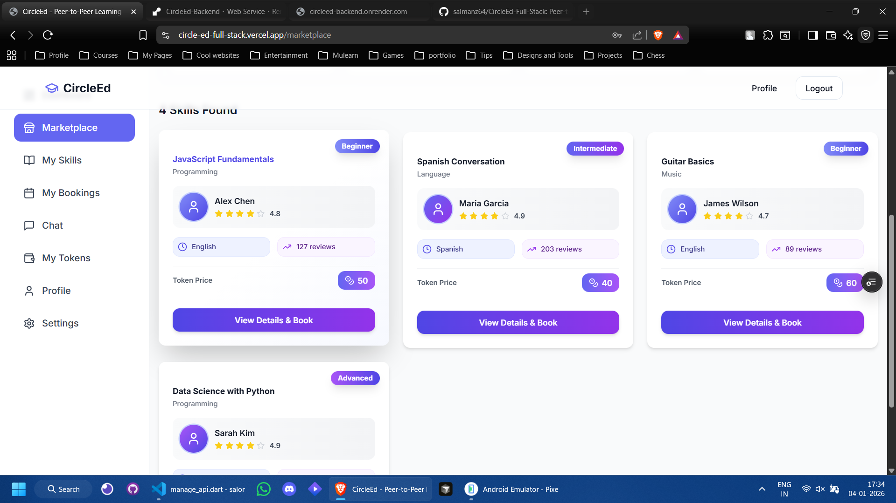

# 🌙 CircleEd — Peer-to-Peer Learning Platform

CircleEd is a modern, dark-themed, full-stack peer-to-peer learning platform that enables users to exchange skills through a token-based economy. The platform is designed to make learning collaborative, accessible, and engaging by allowing users to teach what they know, learn what they need, and earn tokens in the process.

Users can browse a marketplace of skills, book one-on-one learning sessions, chat in real-time, manage their token wallet, and build a public learning profile with reviews and ratings. The system focuses on trust, usability, and scalability, making it suitable for both casual learners and serious professionals.

Built with a performance-focused frontend and a robust backend API, CircleEd follows clean architecture principles, supports future extensibility (AI recommendations, payments, analytics), and is optimized for responsive, cross-device usage.


---

## 🌐 Live Demo

- **Frontend:** https://circle-ed-full-stack.vercel.app  
- **Backend API:** https://circleed-backend.onrender.com  
- **API Docs:** https://circleed-backend.onrender.com/docs

## 🖤 Screenshots

| Home | Market | Dashboard |
|------|--------|-----------|
|  |  |  |

| Chat | Wallet | Profile |
|------|--------|----------|
|  |  |  |

---

## ⚡ Tech Stack

### Frontend
- Next.js 15+
- TypeScript
- TailwindCSS (Dark mode first)
- ShadCN UI
- Zustand
- NextAuth
- React Hook Form + Zod
- Lucide Icons

### Backend
- FastAPI
- PostgreSQL / SQLite
- SQLAlchemy
- Pydantic
- JWT Authentication

---

## 🛠 Getting Started

### Frontend Setup
```bash
cd frontend
npm install
npm run dev
```

### Backend Setup
```bash
cd backend
python -m venv venv
source venv/bin/activate   # Windows: venv\Scripts\activate
pip install -r requirements.txt
cp .env.example .env
python -m app.db.init_db
python -m app.db.seed
python run.py
```

---

## 📁 Project Structure

```
/frontend
/backend
/screenshots
```

---

## ✨ Features

- Dark-first UI
- Peer skill exchange
- Token wallet system
- Session booking
- Chat and messaging
- Profile & reviews
- Responsive design

---

## 🎨 Design System

| Item | Value |
|------|--------|
| Background | #020617 |
| Card | #0F172A |
| Accent | #6366F1 |
| Text | #E5E7EB |

---

## 🔌 API Endpoints

- POST `/api/v1/auth/login`
- GET `/api/v1/skills`
- POST `/api/v1/sessions`
- GET `/api/v1/transactions`
- GET `/api/v1/chats`

---

## 🧩 Roadmap

- JWT frontend integration
- WebSocket chat
- Payment integration
- AI skill recommendations
- Skill verification badges
- Analytics dashboard
- Admin moderation panel
- Deployment

---

## 🤝 Contributing

1. Fork the repo
2. Create a feature branch
3. Commit your changes
4. Open a pull request

---

## 📜 License

MIT
